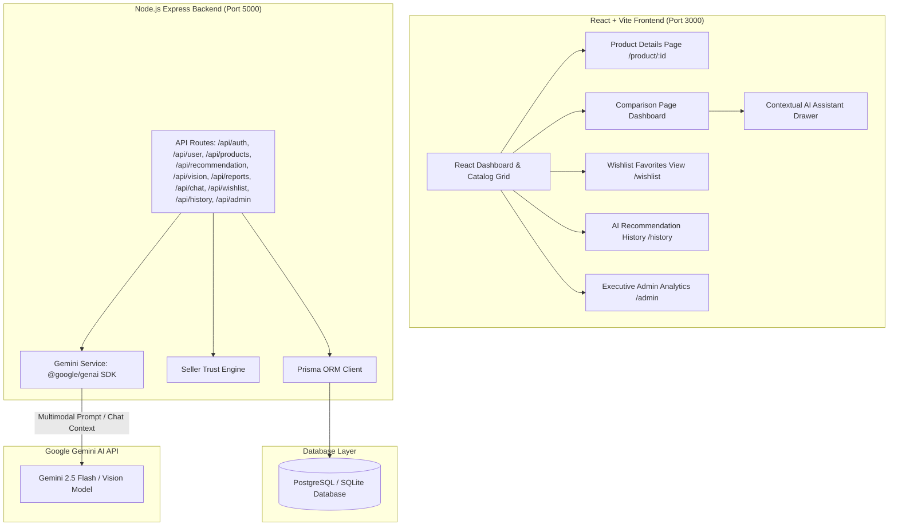

# ProdIQ – AI Product Intelligence Platform (v1.1 Startup Release)

ProdIQ is a production-grade full-stack AI Product Intelligence Platform designed to transform raw product information into meaningful, transparent insights. ProdIQ evaluates products across multi-dimensional metrics, performs side-by-side analytics, calculates seller trust intelligence scores, and uses explainable AI reasoning (Gemini API) to guide buying decisions.

---

## 🌟 Complete Feature Matrix (Phases 1 - 6 Completed)

- **Monorepo Architecture**: Clean separation between React frontend (`/client`) and Node.js Express backend (`/server`).
- **PostgreSQL & Prisma ORM Data Layer**:
  - `User`, `UserPreference`, `Product`, `Review`, `SavedReport`, `Wishlist`, `RecommendationHistory`, `SellerTrust`, and `AnalyticsEvent` models.
  - 7+ pre-seeded electronic products with specs, 6-month historical price trends, and review sentiment.
- **Secure JWT Authentication**:
  - `POST /api/auth/register`, `POST /api/auth/login`, `GET /api/auth/me`.
- **User Preference Profile API**:
  - `GET /api/user/profile` & `PUT /api/user/profile` (`DEVELOPER`, `GAMER`, `STUDENT`, `BUDGET`).
- **Product Catalog & Multi-Facet Search API**:
  - `GET /api/products` & `GET /api/products/:id` with simultaneous filtering by Brand, Processor, RAM, Storage, GPU, Category, Seller, Price Range, and Rating.
- **Dedicated Product Details Page (`/product/:id`)**:
  - High-res product images, technical specs grid, seller trust score breakdown, 6-month price chart, AI review pros/cons summary, similar products carousel, and wishlist toggle button.
- **Explainable AI Ranking Report (`ExplainableScoreReport.tsx`)**:
  - Transparent weighted score breakdown across Price Score, Performance Score, Display Score, Battery Score, Build Quality Score, and Value for Money Score.
- **Seller Trust Intelligence Engine (`sellerTrustEngine.ts` & `SellerTrustBadge.tsx`)**:
  - Calculates Seller Trust Score (0–100) combining rating (30%), review volume (20%), delivery reliability (25%), price stability (15%), and return policy (10%).
- **Wishlist & Saved Favorites (`WishlistPage.tsx` & `/api/wishlist`)**:
  - Save/remove favorite products stored persistently in PostgreSQL database.
- **AI Recommendation History (`RecommendationHistoryPage.tsx` & `/api/history`)**:
  - Persists past AI recommendations in database with search, delete, and 1-click report reopening.
- **Admin Analytics Dashboard (`AdminDashboardPage.tsx` & `/api/admin/analytics`)**:
  - Protected executive dashboard displaying platform metrics (Users, Products, Comparisons, AI Calls) with Recharts graphs.
- **Official `@google/genai` SDK Backend Integration (`geminiService.ts`)**:
  - Express API endpoint `POST /api/recommendation` prompting `gemini-2.5-flash`.
- **Multimodal Gemini Vision Product Identification (`VisionUploadModal.tsx`)**:
  - Express API endpoint `POST /api/vision`.
- **Interactive Contextual AI Assistant Drawer (`AIChatDrawer.tsx` & `chatService.ts`)**:
  - Express API endpoint `POST /api/chat`.

---

## 🏗️ System Architecture & Data Flow (Mermaid)



---

## 📁 Repository Folder Structure

```
AI ASSISTANCE PRODUCT
├── client/                                 # React + Vite + TypeScript Frontend
│   ├── src/
│   │   ├── components/
│   │   │   ├── Navbar.tsx                 # Header navigation bar
│   │   │   ├── ProductCard.tsx            # Card component with Wishlist heart & Seller Trust badge
│   │   │   ├── SkeletonCard.tsx           # Skeleton loading state card
│   │   │   ├── EmptyState.tsx             # Friendly empty state illustration
│   │   │   ├── SellerTrustBadge.tsx       # Hover card explaining Seller Trust Score math
│   │   │   ├── ExplainableScoreReport.tsx # Multi-metric weighted breakdown
│   │   │   ├── AdvancedFilterDrawer.tsx   # Multi-facet sidebar filter
│   │   │   ├── UserPreferenceModal.tsx    # Modal to configure Developer, Gamer, Student profiles
│   │   │   ├── ComparisonMatrix.tsx       # Side-by-side feature comparison table
│   │   │   ├── ValueScoreBreakdown.tsx    # Transparent score breakdown card
│   │   │   ├── PriceHistoryChart.tsx      # Recharts line graph showing 6-month price trends
│   │   │   ├── AIRecommendationPanel.tsx  # Explainable AI buying advice & top 5 pros/cons
│   │   │   ├── VisionUploadModal.tsx      # Gemini Vision product photo matching modal
│   │   │   ├── AIChatDrawer.tsx           # Floating contextual AI assistant drawer
│   │   │   └── SavedReportsModal.tsx      # Saved intelligence reports manager
│   │   ├── pages/
│   │   │   ├── LoginPage.tsx              # Sign-in view
│   │   │   ├── SignupPage.tsx             # User registration view
│   │   │   ├── DashboardPage.tsx          # Catalog grid, search, filters & vision button
│   │   │   ├── ComparisonPage.tsx         # Side-by-side analytics dashboard route (/compare)
│   │   │   ├── ProductDetailPage.tsx      # Dedicated product page (/product/:id)
│   │   │   ├── WishlistPage.tsx           # Saved favorites page (/wishlist)
│   │   │   ├── RecommendationHistoryPage.tsx # Past AI recommendations page (/history)
│   │   │   └── AdminDashboardPage.tsx     # Executive platform analytics (/admin)
│   │   ├── App.tsx                        # Main Router configuration & global AI assistant
│   │   └── index.css                      # Tailwind directives & glassmorphic styling
├── server/                                # Node.js + Express + TypeScript Backend
│   ├── prisma/
│   │   ├── dev.db                         # Database instance
│   │   ├── schema.prisma                  # Prisma Schema with 9 models
│   │   └── seed.ts                        # Seed script for products, sellers, admin user
│   ├── src/
│   │   ├── utils/                         # Seller Trust Engine calculation math
│   │   ├── services/                      # Auth, Profile, Product, Gemini, Report, Chat, Wishlist, History, Admin services
│   │   ├── controllers/                   # Express request controllers
│   │   ├── routes/                        # API route declarations
│   │   └── index.ts                       # Express App entry point
└── README.md                              # Master project documentation
```

---

## 📡 API Endpoints Summary

| Method | Endpoint | Auth Required | Description |
| :--- | :--- | :--- | :--- |
| `GET` | `/api/health` | No | Service status health check |
| `POST` | `/api/auth/register` | No | User registration |
| `POST` | `/api/auth/login` | No | Authenticate user and issue JWT token |
| `GET` | `/api/auth/me` | Yes | Get authenticated user profile |
| `GET` | `/api/user/profile` | Yes | Get user preference profile |
| `PUT` | `/api/user/profile` | Yes | Update target persona (`DEVELOPER`, `GAMER`, etc.) |
| `GET` | `/api/products` | No | Fetch product catalog with multi-facet filters |
| `GET` | `/api/products/:id` | No | Fetch product details & seller trust score |
| `POST` | `/api/recommendation` | Yes | Synthesize Explainable AI buying advice & Pros/Cons |
| `POST` | `/api/vision` | No | Match product photo using Gemini 2.5 Flash Vision |
| `POST` | `/api/reports` | Yes | Save intelligence report |
| `GET` | `/api/reports` | Yes | Fetch user's saved intelligence reports |
| `DELETE` | `/api/reports/:id` | Yes | Delete saved intelligence report |
| `POST` | `/api/chat` | No | Ask contextual AI assistant questions |
| `GET` | `/api/wishlist` | Yes | Fetch user's saved wishlist products |
| `POST` | `/api/wishlist/toggle` | Yes | Toggle product wishlist state |
| `GET` | `/api/history` | Yes | Fetch AI recommendation history |
| `DELETE` | `/api/history/:id` | Yes | Delete AI recommendation history entry |
| `GET` | `/api/admin/analytics` | Admin Only | Fetch platform analytics for admin dashboard |

---

## 📋 Comprehensive Testing & Deployment Checklist

### ✅ Testing Checklist
- [x] **Authentication Verification**: Registered user and logged in (`demo@prodiq.ai` & `admin@prodiq.ai`).
- [x] **Product Details View**: Navigated to `/product/:id`; verified high-res image, specs table, seller trust score, and price history chart.
- [x] **Explainable AI Ranking**: Verified weighted score breakdown for Overall, Value, Performance, Display, and Battery scores.
- [x] **Advanced Search & Filtering**: Tested simultaneous filtering by brand, processor, RAM, and category.
- [x] **Wishlist Workflow**: Tested adding and removing items from Wishlist; verified persistence in `/wishlist`.
- [x] **AI Recommendation History**: Generated comparison reports; verified persistence in `/history` and 1-click reopening.
- [x] **Admin Analytics Dashboard**: Authenticated as `admin@prodiq.ai`; verified KPI metrics and Recharts analytics graphs.
- [x] **Build Verification**: Ran `npm run build` in `/server` and `/client` (0 compilation errors).

### 🚀 Production Deployment Checklist
- [ ] Set `DATABASE_URL` environment variable to production PostgreSQL database string.
- [ ] Run `npx prisma db push` or `npx prisma migrate deploy` on production database instance.
- [ ] Configure `GEMINI_API_KEY` in server environment variables.
- [ ] Set `JWT_SECRET` to a cryptographically secure random secret string.
- [ ] Deploy `/server` to Node.js hosting platform (e.g. AWS App Runner, Render, Railway, GCP Cloud Run).
- [ ] Deploy `/client` to CDN static web host (e.g. Vercel, Netlify, Cloudflare Pages).
